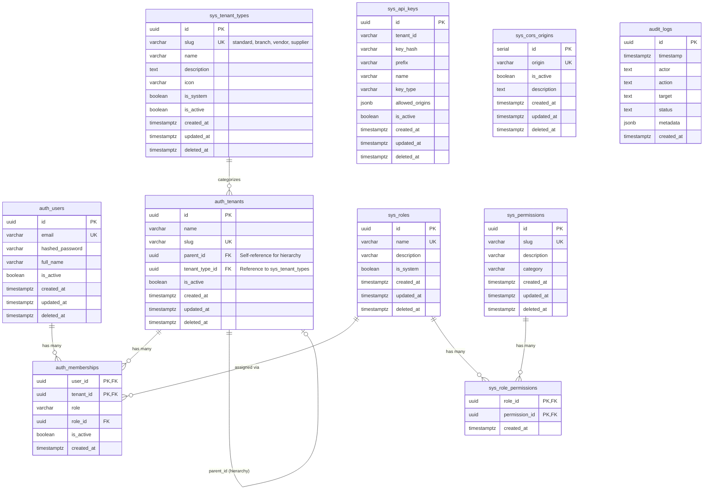
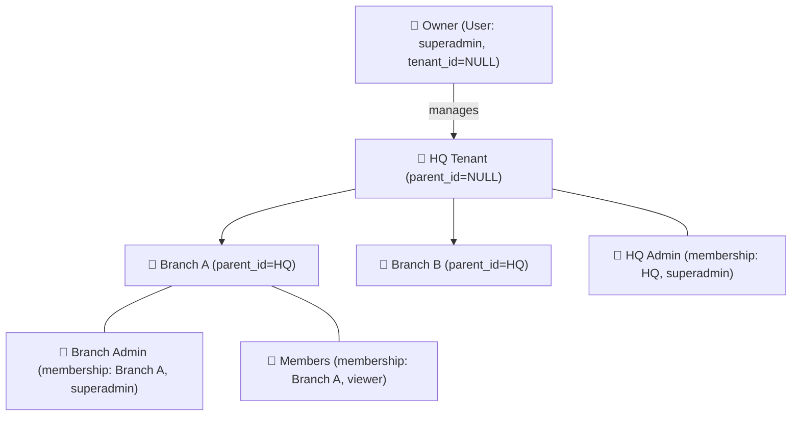

# Kyx Kernel Database Schema

## ER Diagram

## Tenant Hierarchy Example

## Table Categories

| Category | Tables | Soft Delete |
|----------|--------|:-----------:|
| **Auth** | auth_users, auth_tenants | ✅ |
| **Join** | auth_memberships, sys_role_permissions | ❌ |
| **System** | sys_roles, sys_permissions, sys_api_keys, sys_cors_origins | ✅ |
| **Transaction** | audit_logs | ❌ |
