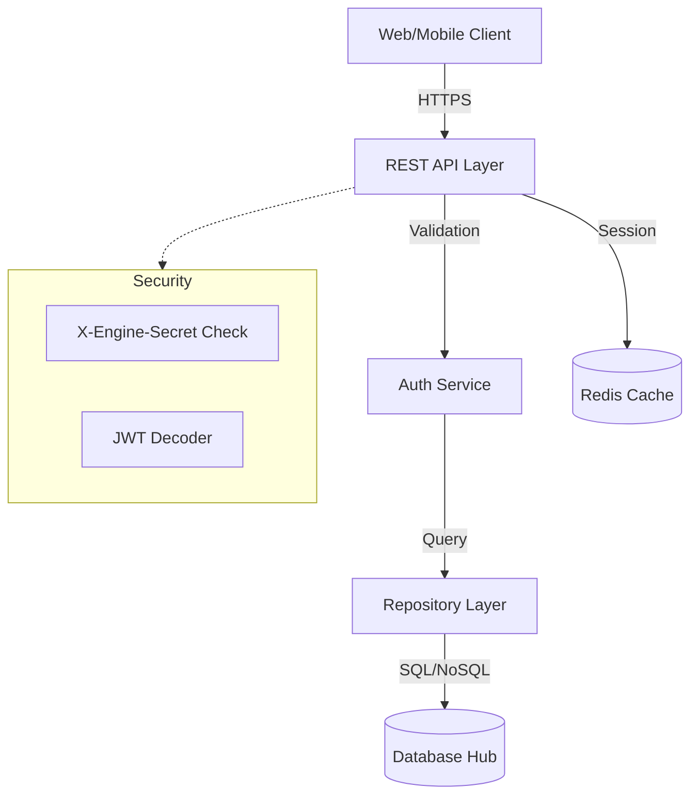

# Project Governance Report: kyx-kernel (AltexSoft Standard)

> Generated at: 2026-01-05T02:15:24.303385094Z

---

## 📄 Documentation

### 1. [Product] PRD: Multi-tenant OS

# Kernel Product Requirement Document (PRD)

## 🎯 Objective

To provide a rock-solid, high-performance, and secure "Multi-tenant Operating System" for the Kyx Ecosystem. The Kernel serves as the central engine for authentication, identity management, and system-wide orchestration.

## 👥 Targeted Audience

- **Backend Engineers**: For API integration and domain logic extension.
- **Frontend Engineers**: For understanding auth flows and data models.
- **System Admins**: For tenant configuration and resource management.

## 💎 Core Capabilities (The "What")

### 1. Multi-Tenant Identity

- Absolute data isolation between organizations.
- Support for hierarchical structures (Sub-tenants).

### 2. Modern Authentication

- JWT-based sessions with industry-standard hashing (Argon2).
- Secure registration and profile management.

### 3. Dynamic Metadata-Driven Core

- Logic behavior controlled by database state, not hardcoded flags.
- Real-time caching of tenant branding and configurations.

### 4. RBAC (Role-Based Access Control)

- Granular permission delegation.
- Pre-defined roles (SuperAdmin, Admin, User).

## 📈 Success Metrics

- < 50ms latency for auth validation.
- zero unauthorized cross-tenant data leaks.
- 100% test coverage for core security logic.

---

### 2. [Product] SAD: Software Architecture

# Kernel Software Architecture Document (SAD)

## 🏢 Architectural Pattern: Modular Monolith

The Kyx Kernel is built in Rust using a modular monolith approach, prioritizing high concurrency and memory safety. It follows **Domain-Driven Design (DDD)** principles to ensure clean separation of concerns.

## 🕸️ High-Level Logic Flow (AI Visualization)



## 📦 Major Components

| Component          | Responsibility                                                 |
| ------------------ | -------------------------------------------------------------- |
| **API Interface**  | Ntex HTTP handlers, request validation, and status codes.      |
| **Domain Logic**   | Core business rules, entities, and repository traits.          |
| **Infra Adapters** | Concrete implementations for SurrealDB, PostgreSQL, and Redis. |
| **Security Hub**   | JWT orchestration, Argon2 hashing, and X-Engine-Secret gating. |

## 📡 Cross-Cutting Concerns

- **Observability**: Metrics exported via Prometheus.
- **Persistence**: Hybrid storage using PostgreSQL for relations and Redis for metadata.

---

### 3. [Product] TDD: Technical Design

# Kernel Technical Design Document (TDD)

## 🛠️ Low-Level Technical Specs

### 1. Repository Pattern (Ports & Adapters)

All data access is mediated through traits to allow swapped implementations (e.g., SQLite for testing vs PostgreSQL for production).

#### `TenantRepository` Implementation Specs

```rust
#[async_trait]
pub trait TenantRepository {
    // Returns tenants visible to the actor based on hierarchical rules
    async fn list(&self, filter: TenantFilter) -> Result<PaginatedTenants>;
}
```

### 🧠 Capability & Implementation Map

| Business Capability  | Implementation Fragment (The "How")                                                   | Developer Interaction                              |
| -------------------- | ------------------------------------------------------------------------------------- | -------------------------------------------------- |
| **Tenant Isolation** | `Recursive Tenant Check` logic using recursive SQL queries or SurrealDB record links. | Filter results by `actor_tenant_id` automatically. |
| **Auth Security**    | `argon2` crate with salt management and high-entropy hashing.                         | Call `AuthService::verify_credentials`.            |
| **Branding**         | `sys_themes` table joined with `tenants`.                                             | Client calls `GET /media/themes`.                  |

## 🧬 Data Model (Core Entities)

```rust
pub struct TenantEntry {
    pub id: Uuid,
    pub name: String,
    pub slug: String,
    pub parent_id: Option<Uuid>, // Hierarchical support
    pub is_active: bool,
}
```

---

### 4. [Product] API Specification

# Kernel API Specification (Updated)

## 🌐 API Overview

Root URL: `/api/v1`
Internal URL: `/internal` (Requires `X-Engine-Secret`)

### 1. Authentication (`/auth`)

- `POST /register`: Create new user/tenant.
- `POST /login`: Identity verification and JWT issuance.
- `POST /refresh`: Session extension.
- `GET /me`: Current user profile and permissions.

---

## ⚖️ Governance Rules

| Priority | Type    | Content                                                                                                                                                       |
| -------- | ------- | ------------------------------------------------------------------------------------------------------------------------------------------------------------- |
| 50       | project | Kyx Kernel uses Rust/Ntex. Prefer functional patterns over imperative ones.                                                                                   |
| 90       | project | Kyx Kernel Standard: ทุก Component ต้องถูกสร้างเป็น Folder โดยมี mod.rs เป็นไฟล์หลัก (Folder-as-Module pattern). ห้ามสร้างไฟล์ .rs เดี่ยวในระดับ module root. |

## 🛡️ Incident Logs

(Empty)
