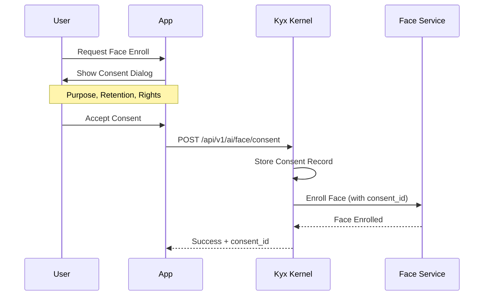

# AI Governance: Face Search

> **KYX RFC-002: Privacy-Compliant Face Recognition**  
> **Status:** Draft  
> **Author:** Kyx Engineering  
> **Date:** 2026-01-07

---

## 1. Overview

This document defines the governance rules for face recognition features in the Kyx ecosystem, ensuring compliance with privacy regulations (PDPA, GDPR) and maintaining user trust.

### Scope

- Face detection and encoding
- Face search/matching
- Biometric data storage and retention
- Consent management
- Audit logging

---

## 2. Privacy Rules

### 2.1 Data Classification

| Data Type      | Classification    | Retention    | Encryption      |
| -------------- | ----------------- | ------------ | --------------- |
| Face Embedding | **Sensitive PII** | Max 90 days  | AES-256 at rest |
| Face Image     | **Sensitive PII** | Max 30 days  | AES-256 at rest |
| Match Result   | Derived           | Session only | TLS in transit  |
| Search Logs    | Audit             | 365 days     | Encrypted       |

### 2.2 Access Control

```yaml
face_search:
  permissions:
    - ai:face:enroll # Add face to database
    - ai:face:search # Search faces
    - ai:face:delete # Remove face data
    - ai:face:audit # View face operation logs

  role_mapping:
    user:
      - ai:face:search (own tenant only)
    admin:
      - ai:face:enroll
      - ai:face:delete
    security_officer:
      - ai:face:audit
```

### 2.3 Rate Limits by Plan

| Plan       | Enrollments/day | Searches/min | Storage (faces) |
| ---------- | --------------- | ------------ | --------------- |
| Free       | 0 (disabled)    | 0            | 0               |
| Pro        | 100             | 20           | 1,000           |
| Enterprise | 10,000          | 200          | 100,000         |

---

## 3. Consent Requirements

### 3.1 User Consent Flow



### 3.2 Consent Record Schema

```json
{
  "consent_id": "uuid",
  "user_id": "uuid",
  "tenant_id": "uuid",
  "purpose": "face_recognition",
  "scope": ["enroll", "search", "match"],
  "granted_at": "2026-01-07T03:30:00Z",
  "expires_at": "2027-01-07T03:30:00Z",
  "revocable": true,
  "data_categories": ["biometric.face"],
  "retention_days": 90
}
```

### 3.3 Consent Revocation

- Users can revoke consent at any time
- Revocation triggers immediate face data deletion
- Search requests fail with 403 if consent revoked
- Audit log preserved (anonymized)

---

## 4. Data Retention Policies

### 4.1 Automatic Deletion

| Trigger         | Action                  | Timeline        |
| --------------- | ----------------------- | --------------- |
| Consent expiry  | Delete all face data    | Within 24 hours |
| User deletion   | Delete all face data    | Immediate       |
| Tenant deletion | Delete all tenant faces | Within 48 hours |
| Retention limit | Auto-purge old data     | Daily cron job  |

### 4.2 Manual Deletion

```
DELETE /api/v1/ai/face/{user_id}
Authorization: Bearer <admin_token>

Response:
{
  "deleted_embeddings": 5,
  "deleted_images": 3,
  "audit_id": "uuid"
}
```

---

## 5. Audit Logging

### 5.1 Required Log Events

| Event          | Logged Data                       | Severity |
| -------------- | --------------------------------- | -------- |
| face.enroll    | user_id, tenant_id, consent_id    | INFO     |
| face.search    | user_id, query_count, match_count | INFO     |
| face.match     | user_id, matched_id, confidence   | WARNING  |
| face.delete    | user_id, deletion_reason          | INFO     |
| consent.grant  | consent details                   | INFO     |
| consent.revoke | consent_id, reason                | WARNING  |

### 5.2 Log Format

```json
{
  "timestamp": "2026-01-07T03:30:00Z",
  "event": "face.search",
  "actor": {
    "user_id": "uuid",
    "tenant_id": "uuid",
    "ip": "192.168.1.1"
  },
  "resource": {
    "type": "face_embedding",
    "count": 1
  },
  "result": {
    "matches": 2,
    "confidence_max": 0.95
  },
  "consent_id": "uuid"
}
```

---

## 6. API Specification

### 6.1 Endpoints

| Method | Endpoint                    | Permission       | Description      |
| ------ | --------------------------- | ---------------- | ---------------- |
| POST   | `/api/v1/ai/face/consent`   | (self)           | Grant consent    |
| DELETE | `/api/v1/ai/face/consent`   | (self)           | Revoke consent   |
| POST   | `/api/v1/ai/face/enroll`    | `ai:face:enroll` | Enroll face      |
| POST   | `/api/v1/ai/face/search`    | `ai:face:search` | Search faces     |
| DELETE | `/api/v1/ai/face/{user_id}` | `ai:face:delete` | Delete face data |
| GET    | `/api/v1/ai/face/audit`     | `ai:face:audit`  | View audit logs  |

### 6.2 Request: Face Search

```json
{
  "image": "base64_encoded_image",
  "threshold": 0.8,
  "max_results": 5
}
```

### 6.3 Response: Face Search

```json
{
  "matches": [
    {
      "user_id": "uuid",
      "confidence": 0.95,
      "enrolled_at": "2026-01-01T00:00:00Z"
    }
  ],
  "search_time_ms": 45,
  "consent_verified": true
}
```

---

## 7. Security Considerations

### 7.1 Encryption

- Face embeddings encrypted with AES-256-GCM
- Encryption keys managed in HSM/Vault
- Keys rotated quarterly

### 7.2 Transport

- TLS 1.3 required
- Face images never logged
- Embeddings never exposed in API responses

### 7.3 Isolation

- Tenant data strictly isolated
- Cross-tenant queries prohibited
- Rate limiting per tenant

---

## 8. Integration with kyx-governance

### 8.1 Document Registration

```sql
INSERT INTO sdlc_document {
  project: "kyx-kernel",
  phase: "design",
  name: "ai-governance-face-search",
  title: "AI Governance: Face Search",
  content: "..."
};
```

### 8.2 Rule Definition

```sql
INSERT INTO governance_rule {
  name: "face-consent-required",
  scope: "global",
  category: "privacy",
  rule_text: "Face recognition requires explicit user consent",
  severity: "critical",
  is_active: true
};
```

### 8.3 Incident Tracking

| Incident Type                   | Auto-Report | Escalation    |
| ------------------------------- | ----------- | ------------- |
| Consent bypass attempt          | Yes         | Security Team |
| Unauthorized cross-tenant query | Yes         | Compliance    |
| Data retention violation        | Yes         | DPO           |
| Unusual search pattern          | Yes         | Security Team |

---

## 9. Compliance Checklist

- [ ] PDPA Article 26: Consent for sensitive data
- [ ] GDPR Article 9: Biometric data processing
- [ ] GDPR Article 17: Right to erasure
- [ ] GDPR Article 30: Records of processing
- [ ] ISO 27001: Information security controls
- [ ] SOC 2 Type II: Security and privacy

---

## 10. Next Steps

1. **Phase 1:** Define API contracts (this document)
2. **Phase 2:** Implement consent management in kyx-kernel
3. **Phase 3:** Integrate face search service (kyx-signal/face module)
4. **Phase 4:** Audit logging and compliance reporting
5. **Phase 5:** External security audit

---

> **Document Version:** 1.0.0  
> **Last Updated:** 2026-01-07  
> **Review Cycle:** Quarterly
