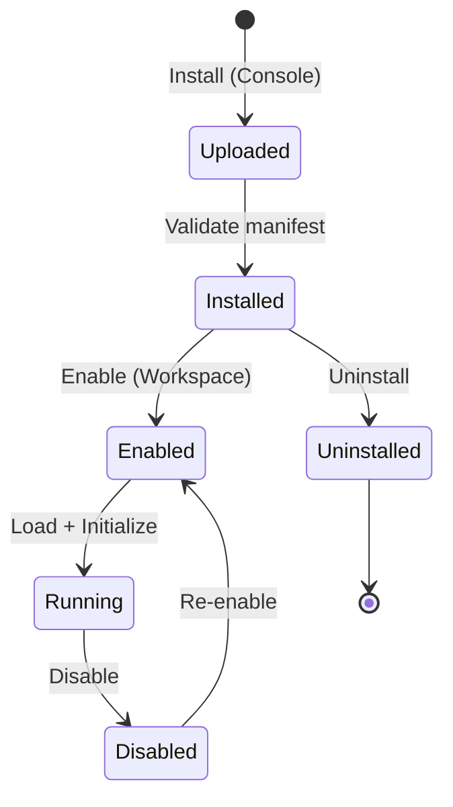

# Plugin Contract v1.0 — Specification

> **Version**: 1.0.0  
> **Date**: 2026-01-18  
> **Status**: FROZEN ✅

---

## Overview

This document defines the contract between the Kyx Kernel and Plugin ecosystem.

All plugins **MUST** comply with this specification to be installable and runnable.

---

## Plugin Lifecycle



### Lifecycle States

| State           | Description                | Context   | Permissions        |
| --------------- | -------------------------- | --------- | ------------------ |
| **Uploaded**    | Plugin file uploaded       | Console   | `plugin:install`   |
| **Installed**   | Validated and registered   | Console   | System-wide        |
| **Enabled**     | Activated for tenant       | Workspace | `plugin:enable`    |
| **Running**     | Actively processing events | Workspace | Per plugin         |
| **Disabled**    | Deactivated but installed  | Workspace | None               |
| **Uninstalled** | Removed from system        | Console   | `plugin:uninstall` |

---

## Manifest Schema

### Required Fields

```json
{
  "id": "com.kyx.example-plugin",
  "name": "Example Plugin",
  "version": "1.0.0",
  "api_version": "v1",
  "author": "Kyx Team",
  "description": "Plugin description",
  "entry_point": "main.wasm",

  "permissions": ["tenant:user:read", "tenant:order:write"],

  "events": {
    "listens_to": ["tenant.user.created", "tenant.order.placed"],
    "emits": ["plugin.example.notification_sent"]
  },

  "hooks": {
    "on_install": "install_hook",
    "on_enable": "enable_hook",
    "on_disable": "disable_hook",
    "on_uninstall": "uninstall_hook"
  },

  "config_schema": {
    "type": "object",
    "properties": {
      "api_key": { "type": "string" },
      "webhook_url": { "type": "string", "format": "uri" }
    },
    "required": ["api_key"]
  }
}
```

---

## Permission Model

### Permission Scopes

Plugins can request permissions in **3 scopes**:

| Scope      | Pattern                       | Example                         | Access          |
| ---------- | ----------------------------- | ------------------------------- | --------------- |
| **Tenant** | `tenant:{resource}:{action}`  | `tenant:user:read`              | Own tenant only |
| **Public** | `public:{resource}:{action}`  | `public:page:read`              | Public APIs     |
| **Plugin** | `plugin:{plugin_id}:{action}` | `plugin:com.kyx.example:config` | Plugin data     |

### Permission Authorization

```rust
// During installation
fn check_plugin_permissions(manifest: &Manifest) -> Result<()> {
    for permission in &manifest.permissions {
        if permission.starts_with("system:") {
            return Err("Plugins cannot request system: permissions");
        }
    }
    Ok(())
}

// During runtime
fn authorize_plugin_action(plugin_id: &str, permission: &str, tenant_id: Uuid) -> bool {
    // Check if plugin was granted permission at install time
    // AND verify tenant_id matches execution context
}
```

---

## Event System Integration

### Listening to Events

Plugins declare which events they listen to in `manifest.json`:

```json
{
  "events": {
    "listens_to": [
      "tenant.user.created",
      "tenant.order.placed",
      "tenant.*.updated" // Wildcard support
    ]
  }
}
```

**Kernel Behavior**:

```rust
// When event is published
pub async fn publish_event(event: CoreEvent) {
    // Notify all registered plugins
    for plugin in get_plugins_listening_to(&event) {
        if plugin.is_enabled(tenant_id) {
            plugin.handle_event(event.clone()).await;
        }
    }
}
```

### Emitting Events

Plugins can emit custom events:

```json
{
  "events": {
    "emits": [
      "plugin.example.notification_sent",
      "plugin.example.sync_completed"
    ]
  }
}
```

**Emitted events follow naming**: `plugin.{plugin_id}.{event_name}`

---

## Hooks

### Lifecycle Hooks

| Hook           | When Called                        | Purpose                            |
| -------------- | ---------------------------------- | ---------------------------------- |
| `on_install`   | After validation, before DB insert | Database migrations, initial setup |
| `on_enable`    | When tenant enables plugin         | Per-tenant initialization          |
| `on_disable`   | When tenant disables plugin        | Cleanup, pause                     |
| `on_uninstall` | Before removal from system         | Drop tables, remove data           |

### Hook Signature

```rust
// WASM export functions
#[no_mangle]
pub extern "C" fn on_install(config_json: *const u8) -> i32 {
    // Return 0 = success, 1 = error
}

#[no_mangle]
pub extern "C" fn on_enable(tenant_id: *const u8) -> i32 {
    // Tenant-specific setup
}
```

---

## Configuration

### Config Schema

Plugins define their configuration schema using JSON Schema:

```json
{
  "config_schema": {
    "type": "object",
    "properties": {
      "api_key": {
        "type": "string",
        "description": "API key for external service"
      },
      "webhook_url": {
        "type": "string",
        "format": "uri",
        "description": "Webhook endpoint"
      },
      "send_notifications": {
        "type": "boolean",
        "default": true
      }
    },
    "required": ["api_key"]
  }
}
```

### Per-Tenant Configuration

```
/api/v1/admin/plugins/{plugin_id}/config
```

```json
{
  "tenant_id": "uuid",
  "config": {
    "api_key": "sk_live_xxx",
    "webhook_url": "https://example.com/webhook",
    "send_notifications": false
  }
}
```

---

## Security & Isolation

### Sandboxing (WASM)

All plugins run in **WebAssembly sandbox**:

- ✅ Memory isolation
- ✅ No direct file system access
- ✅ No direct network access
- ✅ Host function calls only

### Resource Limits

```rust
pub struct PluginResourceLimits {
    pub max_memory_mb: u32,        // Default: 128MB
    pub max_execution_ms: u64,      // Default: 5000ms
    pub max_events_per_minute: u32, // Default: 100
}
```

### Host Functions

Plugins access kernel services via host functions:

```rust
// Available to plugins
#[wasm_bindgen]
extern "C" {
    fn kyx_log(level: u32, message: *const u8);
    fn kyx_http_get(url: *const u8) -> i32;
    fn kyx_storage_get(key: *const u8) -> *const u8;
    fn kyx_storage_set(key: *const u8, value: *const u8);
}
```

---

## Plugin Discovery & Installation

### Plugin Registry Structure

```
plugins/
├── com.kyx.example-plugin/
│   ├── manifest.json
│   ├── main.wasm
│   ├── README.md
│   └── icon.png
```

### Installation Flow

```
1. Upload plugin.zip to Console
   → POST /api/v1/admin/plugins/upload

2. Kernel validates manifest
   → Check permissions, API version, schema

3. Extract and store in DB
   → sys_plugins table

4. Call on_install hook
   → Plugin initialization

5. Plugin ready for enablement
   → Workspace admins can enable
```

---

## API Endpoints

| Endpoint                          | Method  | Context   | Description             |
| --------------------------------- | ------- | --------- | ----------------------- |
| `/admin/plugins/upload`           | POST    | Console   | Upload & install plugin |
| `/admin/plugins`                  | GET     | Console   | List all plugins        |
| `/admin/plugins/{id}`             | DELETE  | Console   | Uninstall plugin        |
| `/workspace/plugins`              | GET     | Workspace | List available plugins  |
| `/workspace/plugins/{id}/enable`  | POST    | Workspace | Enable for tenant       |
| `/workspace/plugins/{id}/disable` | POST    | Workspace | Disable for tenant      |
| `/workspace/plugins/{id}/config`  | GET/PUT | Workspace | Get/update config       |

---

## Versioning & Compatibility

### API Versioning

Plugins declare required `api_version`:

```json
{
  "api_version": "v1"
}
```

**Kernel guarantees backwards compatibility within major version.**

### Plugin Updates

```
1. Upload new version (Console)
2. Kernel checks compatibility
3. If breaking → require tenant re-enablement
4. If compatible → hot reload
```

---

## Error Handling

### Plugin Errors

```rust
pub enum PluginError {
    InvalidManifest,
    InsufficientPermissions,
    HookFailed,
    ResourceLimitExceeded,
    DependencyMissing,
}
```

### Error Propagation

- Plugin errors **MUST NOT crash kernel**
- Errors logged to `audit_logs`
- Tenant notified via dashboard
- Plugin auto-disabled after 3 consecutive failures

---

## Example Plugins

### 1. Email Notification Plugin

```json
{
  "id": "com.kyx.email-notifier",
  "events": {
    "listens_to": ["tenant.order.placed"]
  },
  "permissions": ["tenant:customer:read"]
}
```

### 2. Analytics Plugin

```json
{
  "id": "com.kyx.analytics",
  "events": {
    "listens_to": ["tenant.*.*"],
    "emits": ["plugin.analytics.report_generated"]
  },
  "permissions": ["tenant:order:read", "tenant:user:read"]
}
```

---

## Compliance Checklist

Before submitting a plugin:

- [ ] Manifest validates against schema
- [ ] All permissions justified in README
- [ ] Hooks implemented (at least `on_install`)
- [ ] Resource limits tested
- [ ] Error handling for all external calls
- [ ] Documentation complete
- [ ] Icon provided (256x256 PNG)

---

> **Note**: This is v1.0 of the Plugin Contract.  
> Breaking changes will increment to v2.0 with migration guide.
