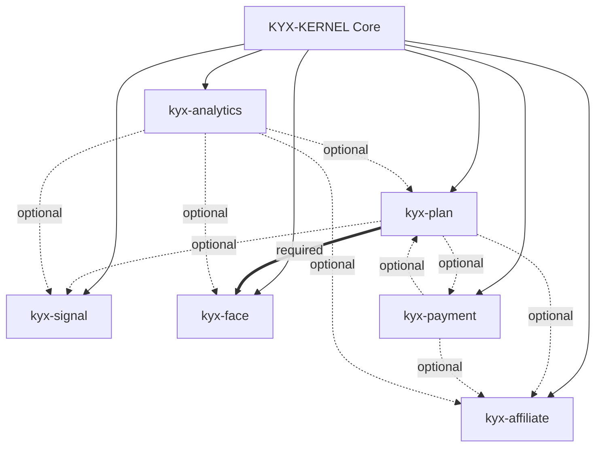

# Kyx Plugin Ecosystem Overview

> **Date:** 2026-01-07  
> **Status:** Draft

---

## 1. Plugin Architecture

```
┌─────────────────────────────────────────────────────────┐
│                   KYX-KERNEL (Core)                     │
│  Auth, RBAC, Tenant, Media, Plugin Engine               │
│  ─────────────────────────────────────────────────────  │
│  Size: ~10,000 lines | Zero external dependencies      │
└───────────────────────────┬─────────────────────────────┘
                            │ Plugin API
        ┌───────────────────┼───────────────────┐
        ▼                   ▼                   ▼
   ┌─────────┐        ┌──────────┐        ┌─────────┐
   │kyx-plan │        │kyx-affil │        │kyx-face │
   │(billing)│        │(referral)│        │  (AI)   │
   └─────────┘        └──────────┘        └─────────┘
        │                   │                   │
   ┌─────────┐        ┌──────────┐        ┌─────────┐
   │kyx-pay  │        │kyx-signal│        │kyx-anal │
   │(payment)│        │(realtime)│        │(metrics)│
   └─────────┘        └──────────┘        └─────────┘
```

---

## 2. Available Plugins

| Plugin                                    | Description              | Required Deps | Spec |
| ----------------------------------------- | ------------------------ | ------------- | ---- |
| [kyx-plan](PLUGIN_SPEC_PLAN.md)           | Plans & subscriptions    | None          | ✅   |
| [kyx-affiliate](PLUGIN_SPEC_AFFILIATE.md) | Referrals & commissions  | None          | ✅   |
| [kyx-signal](PLUGIN_SPEC_SIGNAL.md)       | Realtime & notifications | None          | ✅   |
| [kyx-face](PLUGIN_SPEC_FACE.md)           | AI face recognition      | kyx-plan      | ✅   |
| [kyx-analytics](PLUGIN_SPEC_ANALYTICS.md) | Business intelligence    | None          | ✅   |
| [kyx-payment](PLUGIN_SPEC_PAYMENT.md)     | Payment processing       | None          | ✅   |

---

## 3. Independence Matrix

| Use Case          | plan | affiliate | signal | face | analytics | payment |
| ----------------- | ---- | --------- | ------ | ---- | --------- | ------- |
| Simple CMS        | ❌   | ❌        | ❌     | ❌   | ❌        | ❌      |
| Blog + referrals  | ❌   | ✅        | ❌     | ❌   | ❌        | ❌      |
| SaaS billing only | ✅   | ❌        | ❌     | ❌   | ❌        | ✅      |
| SaaS + Affiliates | ✅   | ✅        | ❌     | ❌   | ❌        | ✅      |
| Realtime chat     | ❌   | ❌        | ✅     | ❌   | ❌        | ❌      |
| Enterprise AI     | ✅   | ❌        | ✅     | ✅   | ✅        | ✅      |
| Full platform     | ✅   | ✅        | ✅     | ✅   | ✅        | ✅      |

---

## 4. Integration Map



---

## 5. Core Rules

### Rule 1: Zero Crash Guarantee

```rust
// Plugin lookup NEVER panics
if let Some(plan) = plugins.get("kyx-plan") {
    plan.apply_limits();
}
```

### Rule 2: Optional Integration

```rust
// Plugins can enhance each other but don't require
let rate = if let Some(plan) = plugins.get("kyx-plan") {
    plan.get_commission_rate()
} else {
    default_rate
};
```

### Rule 3: Database Isolation

```
Core:       sys_* tables
Plan:       plugin_plans, plugin_user_plans
Affiliate:  plugin_affiliates, plugin_commissions
Signal:     plugin_notifications, plugin_notification_prefs
Face:       plugin_face_*, plugin_face_consents
Analytics:  plugin_analytics_*
Payment:    plugin_transactions, plugin_subscriptions
```

---

## 6. Plugin Manifest Standard

```yaml
id: string # Unique identifier
name: string # Display name
version: semver # Version number
author: string # Author/team
description: string # Short description
capabilities: # What plugin can do
  - database:read
  - database:write
  - http:external
  - claims:extend
permissions: # Required RBAC permissions
  - resource:action
settings: # Default configuration
  key: value
required_integrations: # Must have these plugins
  - plugin-id
optional_integrations: # Can use if available
  - plugin-id
```

---

## 7. Roadmap

| Phase | Plugin        | Priority | Status       |
| ----- | ------------- | -------- | ------------ |
| A     | kyx-plan      | P1       | 📋 Spec done |
| A     | kyx-affiliate | P1       | 📋 Spec done |
| B     | kyx-signal    | P1       | 📋 Spec done |
| B     | kyx-payment   | P1       | 📋 Spec done |
| C     | kyx-analytics | P2       | 📋 Spec done |
| D     | kyx-face      | P3       | 📋 Spec done |

---

## 8. Documents Index

| Document                                                           | Description                    |
| ------------------------------------------------------------------ | ------------------------------ |
| [PLUGIN_SPEC_PLAN.md](PLUGIN_SPEC_PLAN.md)                         | Plan & subscription plugin     |
| [PLUGIN_SPEC_AFFILIATE.md](PLUGIN_SPEC_AFFILIATE.md)               | Affiliate & referral plugin    |
| [PLUGIN_SPEC_SIGNAL.md](PLUGIN_SPEC_SIGNAL.md)                     | Realtime & notification plugin |
| [PLUGIN_SPEC_FACE.md](PLUGIN_SPEC_FACE.md)                         | Face recognition plugin        |
| [PLUGIN_SPEC_ANALYTICS.md](PLUGIN_SPEC_ANALYTICS.md)               | Analytics plugin               |
| [PLUGIN_SPEC_PAYMENT.md](PLUGIN_SPEC_PAYMENT.md)                   | Payment processing plugin      |
| [AI_GOVERNANCE_FACE_SEARCH.md](AI_GOVERNANCE_FACE_SEARCH.md)       | Face recognition governance    |
| [RFC_SIGNAL_AUTH.md](RFC_SIGNAL_AUTH.md)                           | Signal authentication RFC      |
| [ARCHITECTURE_DECISION_RECORD.md](ARCHITECTURE_DECISION_RECORD.md) | Overall architecture ADR       |
